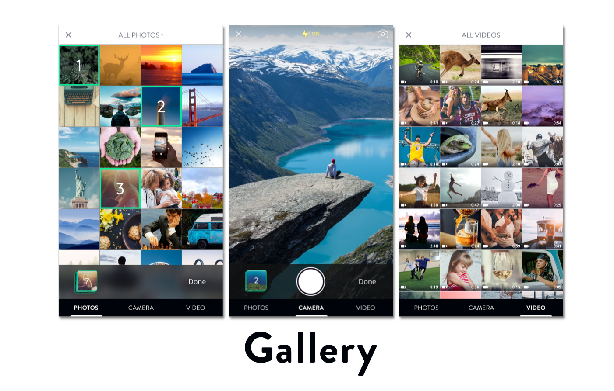

[](http://cocoadocs.org/docsets/Gallery)
[](https://github.com/Carthage/Carthage)
[](http://cocoadocs.org/docsets/Gallery)
[](http://cocoadocs.org/docsets/Gallery)


## Description


We all love image pickers, don't we? You may already know of [ImagePicker](https://github.com/hyperoslo/ImagePicker), the all in one solution for capturing pictures and selecting images. Well, it has a sibling too, called `Gallery`. Based on the same engine that powers ImagePicker, Gallery has a clearer flow based on albums and focuses on the use case of selecting video. If this suits your need, give it a try 😉

`Gallery` has 3 tabs with easy navigation through swipe gesture

- Images: select albums and images. Handle selection with hightlighted numbers so your users don't forget the order
- Camera: your photographer skill goes here
- Videos: display all videos and select. For now the use case is to select one video at a time

And, it has zero dependencies 😎

## Usage

### Presenting

`GalleryController` is the main entry point, just instantiate and give it the delegate

```swift
let gallery = GalleryController()
gallery.delegate = self
present(gallery, animated: true, completion: nil)
```

The content controller is not loaded until the users navigate to, which offers a much faster experience.

### Delegate

The `GalleryControllerDelegate` requires you to implement some delegate methods in order to interact with the picker

```swift
func galleryController(_ controller: GalleryController, didSelectImages images: [Image])
func galleryController(_ controller: GalleryController, didSelectVideo video: Video)
func galleryController(_ controller: GalleryController, requestLightbox images: [Image])
func galleryControllerDidCancel(_ controller: GalleryController)
```

The lightbox delegate method is your chance to display selected images. If you're looking for a nice solution, here is the [Lightbox](https://github.com/hyperoslo/Lightbox) that we use and love

### Resolving

The delegate methods give you `Image` and `Video`, which are just wrappers around `PHAsset`. To get the actual asset informations, we offer many convenient methods. See [example](https://github.com/hyperoslo/Gallery/blob/master/Example/GalleryDemo/GalleryDemo/Sources/ViewController.swift)

`Image`

  - Use instance method `resolve` to get the actual UIImage
  - Use static method `Image.resolve` to resolve a list of images

`Video`

  - Use instance method `fetchDuration`, `fetchPlayerItem`, `fetchAVAsset`, `fetchThumbnail` to get more information about the selected video.

### Permission

`Gallery` handles permissions for you. It checks and askes for photo and camera usage permissions at first launch. As of iOS 10, we need to explicitly declare usage descriptions in plist files

```xml
<key>NSCameraUsageDescription</key>
<string>This app requires access to camera</string>
<key>NSPhotoLibraryUsageDescription</key>
<string>This app requires access to photo library</string>
```

### Configuration

There are lots of customization points in `Config` structs. For example

```swift
Config.Permission.image = UIImage(named: ImageList.Gallery.cameraIcon)
Config.Font.Text.bold = UIFont(name: FontList.OpenSans.bold, size: 14)!
Config.Camera.recordLocation = true
Config.tabsToShow = [.imageTab, .cameraTab]
```

### Video Editor

`Gallery` cares more about video with its editing functionalities. We have `VideoEditor` and `AdvancedVideoEditor` to trim, resize, scale and define quality of the selected video

```swift
func galleryController(_ controller: GalleryController, didSelectVideo video: Video) {
  controller.dismiss(animated: true, completion: nil)

  let editor = VideoEditor()
  editor.edit(video: video) { (editedVideo: Video?, tempPath: URL?) in
    DispatchQueue.main.async {
      if let tempPath = tempPath {
        let controller = AVPlayerViewController()
        controller.player = AVPlayer(url: tempPath)

        self.present(controller, animated: true, completion: nil)
      }
    }
  }
}
```

With the `Video` object, you can `fetchPlayerItem`, `fetchAVAsset` and `fetchThumbnail` as well

And, of course, you have the ability to customize it

```swift
Config.VideoEditor.maximumDuration = 30
Config.VideoEditor.savesEditedVideoToLibrary = true
```

## Installation

**Gallery** is available through [CocoaPods](http://cocoapods.org). To install
it, simply add the following line to your Podfile:

```ruby
pod 'Gallery'
```

**Gallery** is also available through [Carthage](https://github.com/Carthage/Carthage).
To install just write into your Cartfile:

```ruby
github "hyperoslo/Gallery"
```

**Gallery** can also be installed manually. Just download and drop `Sources` folders in your project.

## Author

Hyper Interaktiv AS, ios@hyper.no

## Contributing

We would love you to contribute to **Gallery**, check the [CONTRIBUTING](https://github.com/hyperoslo/Gallery/blob/master/CONTRIBUTING.md) file for more info.

## License

**Gallery** is available under the MIT license. See the [LICENSE](https://github.com/hyperoslo/Gallery/blob/master/LICENSE.md) file for more info.
